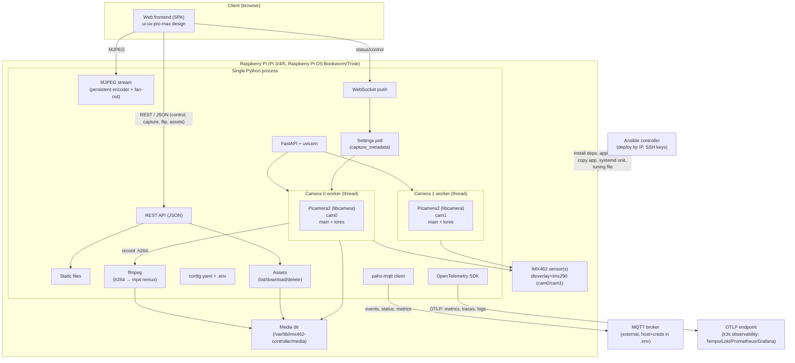

# Architecture

## Overview

A single Python process on the Raspberry Pi exposes a REST API, a static web
frontend, MJPEG live-view streams, and WebSocket push. Camera capture runs in
per-camera threads (Picamera2/libcamera). The process fans telemetry out to MQTT
and OpenTelemetry (OTLP) and is deployed by Ansible.

## Components

| Component | Responsibility | Key tech |
|---|---|---|
| FastAPI app | REST API, static frontend, MJPEG, WebSocket, assets | FastAPI, uvicorn |
| Camera workers | One per camera; photo/video capture, mode/flip, exposure/ISO/WB | Picamera2, thread-per-camera |
| MJPEG fan-out | Persistent `lores` MJPEG encoder + feed thread → per-client queues | MJPEGEncoder, threading |
| Settings poll | Read current gain/exposure via `capture_metadata()` for the status payload | background thread |
| Assets | List/download/delete captured media with metadata | `FileResponse`, traversal-safe |
| ffmpeg remux | Convert recorded raw H.264 → `.mp4` (`-c copy`) | `/usr/bin/ffmpeg` |
| Snapshot | Single still at the requested exposure (up to ~115 s native) | numpy + Pillow |
| Setup configurator | Interactive ASCII/color CLI generating the git-ignored Ansible inventory + host_vars (secrets masked) | `scripts/configure.py`, stdlib-only |
| MQTT client | Publish operation events, heartbeat/status, metrics | paho-mqtt |
| OTel SDK | Metrics + traces + correlated logs to OTLP | opentelemetry-distro |
| Ansible | Provision Pi: deps, dtoverlay, app, systemd unit, config/secrets, tuning file | ansible |

## Concurrency model

- **Single process** owns all cameras (libcamera requirement).
- Each camera gets its own **thread**; blocking capture releases the GIL.
- FastAPI async routes dispatch capture/control to a per-camera `ThreadPoolExecutor`.
- **Live view** uses one persistent `lores` MJPEG encoder per camera plus a feed
  thread that fans frames to per-client `queue.Queue` subscribers — control
  changes never tear the stream down.
- **Single-frame capture mode** tears the MJPEG encoder down (camera at rest) so a
  long exposure can run without a continuous feed; `snapshot` reconfigures the
  camera with the requested exposure and captures one still (runtime
  `set_controls` would lag ~10 in-flight frames, i.e. minutes at long exposures).
- **Controls** (`set_controls`) are applied at runtime; only mode changes
  (`configure_mode`) and flip (`set_flip`) reconfigure (aborting the in-flight frame).
- A background **settings poll** thread reads `capture_metadata()` outside the
  camera lock (with a timeout), so a stalled sensor can never freeze the feed
  thread or control operations.

## Data flows

- **Control/photo/video**: browser → REST → camera worker → media dir / MJPEG/artifact response.
- **Live view**: browser → `` → MJPEG stream (persistent encoder → subscriber queue).
- **Single-frame capture**: browser → REST `stream-mode=single` + `snapshot` → camera
  worker (single native still) → media dir → viewport `` + assets gallery.
- **Status push**: app → WebSocket → browser (live stats, per-camera state, client
  IP list, current ISO/shutter).
- **Assets**: browser → REST → media dir (list/download/delete; video is remuxed
  `.h264` → `.mp4` on stop).
- **Telemetry**: app → MQTT broker (events/status/metrics) and app → OTLP
  (metrics/traces/logs to the k3s observability stack).

