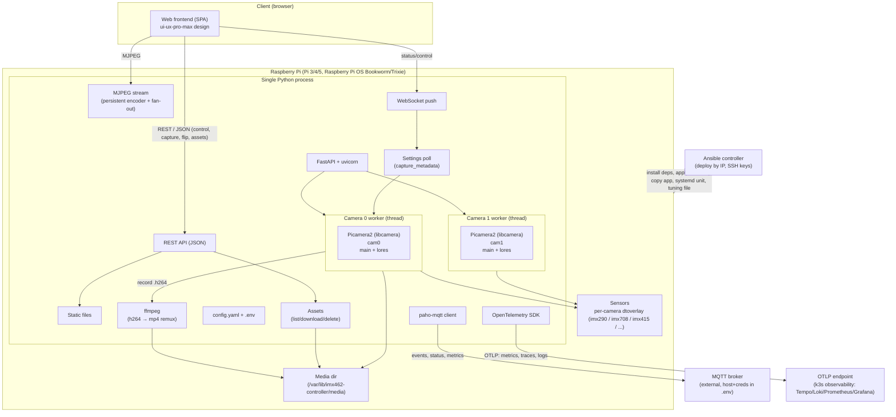

# Architecture

## Overview

A single Python process on the Raspberry Pi exposes a REST API, a static web
frontend, MJPEG live-view streams, and WebSocket push. Camera capture runs in
per-camera threads (Picamera2/libcamera). The process fans telemetry out to MQTT
and OpenTelemetry (OTLP) and is deployed by Ansible.

```mermaid
flowchart TB
    subgraph Client["Client (browser)"]
        FE["Web frontend (SPA)\nui-ux-pro-max design"]
    end

    subgraph Pi["Raspberry Pi (Pi 3/4/5, Raspberry Pi OS Bookworm/Trixie)"]
        subgraph App["Single Python process"]
            HTTP["FastAPI + uvicorn"]
            API["REST API (JSON)"]
            STATIC["Static files"]
            MJPEG["MJPEG stream\n(persistent encoder + fan-out)"]
            WS["WebSocket push"]
            ASSETS["Assets\n(list/download/delete)"]
            SETTINGS["Settings poll\n(capture_metadata)"]
            CFG["config.yaml + .env"]

            subgraph Cam0["Camera 0 worker (thread)"]
                PC0["Picamera2 (libcamera)\ncam0\nmain + lores"]
            end
            subgraph Cam1["Camera 1 worker (thread)"]
                PC1["Picamera2 (libcamera)\ncam1\nmain + lores"]
            end

            MQTTc["paho-mqtt client"]
            OTELc["OpenTelemetry SDK"]
            FFMPEG["ffmpeg\n(h264 → mp4 remux)"]
        end
        MEDIA["Media dir\n(/var/lib/imx462-controller/media)"]
        SENSOR["Sensors\nper-camera dtoverlay (imx290 / imx708 / imx415 / ...)"]
    end

    BROKER["MQTT broker\n(external, host+creds in .env)"]
    COLLECTOR["OTLP endpoint\n(k3s observability: Tempo/Loki/Prometheus/Grafana)"]
    ANSIBLE["Ansible controller\n(deploy by IP, SSH keys)"]

    FE -->|"REST / JSON (control, capture, flip, assets)"| API
    FE -->|"<img> MJPEG"| MJPEG
    FE -->|"status/control"| WS
    API --> STATIC
    API --> ASSETS
    WS --> SETTINGS

    HTTP --> Cam0
    HTTP --> Cam1
    Cam0 --> SENSOR
    Cam1 --> SENSOR
    Cam0 -->|"record .h264"| FFMPEG
    FFMPEG --> MEDIA
    Cam0 --> MEDIA
    ASSETS --> MEDIA
    SETTINGS --> Cam0

    MQTTc -->|"events, status, metrics"| BROKER
    OTELc -->|"OTLP: metrics, traces, logs"| COLLECTOR

    ANSIBLE -->|"install deps, apply dtoverlay,\ncopy app, systemd unit, tuning file"| Pi
```

## Components

| Component | Responsibility | Key tech |
|---|---|---|
| FastAPI app | REST API, static frontend, MJPEG, WebSocket, assets | FastAPI, uvicorn |
| Camera workers | One per camera; photo/video capture, mode/flip, exposure/ISO/WB, per-sensor capability discovery, autofocus | Picamera2, thread-per-camera |
| Autofocus | Camera Module 3 (imx708) VCM: capability discovery, single/continuous/manual focus, periodic refocus, focus-state feedback. Lens position is in dioptres (0 = infinity) | libcamera `AfMode`/`AfTrigger`/`LensPosition`/`AfState` |
| MJPEG fan-out | Persistent `lores` MJPEG encoder + feed thread → per-client queues | MJPEGEncoder, threading |
| Settings poll | Read current gain/exposure via `capture_metadata()` for the status payload | background thread |
| Assets | List/download/delete captured media with metadata | `FileResponse`, traversal-safe |
| ffmpeg remux | Convert recorded raw H.264 → `.mp4` (`-c copy`) | `/usr/bin/ffmpeg` |
| Snapshot | Single still at the requested exposure (up to ~115 s native on the IMX462; other sensors use their own libcamera-reported bounds) | numpy + Pillow |
| Setup configurator | Interactive ASCII/color CLI generating the git-ignored Ansible inventory + host_vars (secrets masked) | `scripts/configure.py`, stdlib-only |
| MQTT client | Publish operation events, heartbeat/status, metrics | paho-mqtt |
| OTel SDK | Metrics + traces + correlated logs to OTLP | opentelemetry-distro |
| Ansible | Provision Pi: deps, dtoverlay, app, systemd unit, config/secrets, tuning file | ansible |

## Concurrency model

- **Single process** owns all cameras (libcamera requirement).
- Each camera gets its own **thread**; blocking capture releases the GIL.
- FastAPI async routes dispatch capture/control to a per-camera `ThreadPoolExecutor`.
- **Live view** uses one persistent `lores` MJPEG encoder per camera plus a
  single feed thread (worker lifetime) that fans frames to per-client
  `queue.Queue` subscribers — control changes never tear the stream down, and
  encoder teardown only clears the output (no feed-thread churn).
- **Single-frame capture mode** tears the MJPEG encoder down (camera at rest) so a
  long exposure can run without a continuous feed; `snapshot` reconfigures the
  camera with the requested exposure and captures one still (runtime
  `set_controls` would lag ~10 in-flight frames, i.e. minutes at long exposures).
  Frame durations requested for manual exposure/snapshots are floored to the
  selected mode's minimum frame time (1/framerate), so low-framerate sensors
  (e.g. IMX415 at ~15 fps on 2-lane boards) never get an out-of-range
  `FrameDurationLimits`.
- **Controls** (`set_controls`) are applied at runtime; only mode changes
  (`configure_mode`) and flip (`set_flip`) reconfigure (aborting the in-flight frame).
- **Autofocus** (sensors with a VCM actuator, e.g. the IMX708) is applied at
  runtime like other controls: `AfMode`/`LensPosition`/`AfRange`/`AfSpeed` persist
  across reconfigures, but the one-shot `AfTrigger` is a transient command and is
  never re-baked (so a reconfigure does not start a new focus cycle). Focus
  defaults to single autofocus on start. Focus state (`AfState`/`LensPosition`)
  is read by the same off-lock metadata thread.
- **AF-assist**: autofocus needs a fast frame rate, so an explicit
  `POST /focus/trigger` on a camera in a long-exposure/manual state temporarily
  reconfigures to auto exposure at the mode's frame rate, sweeps, locks focus at
  the achieved lens position (manual mode), and restores the previous exposure.
  A capture/recording in progress is rejected (409); the assist can be disabled
  per request. An explicit trigger preserves the pre-trigger mode: manual
  re-locks at the achieved lens position, continuous resumes tracking. **Periodic**
  refocus does not assist (that would toggle the exposure every interval), is
  skipped for slow frames, and is disabled in manual/continuous mode (a manual
  lock is never overridden).
- **Focus state freshness**: when a stored frame duration > 1 s pauses the
  metadata poll, `af_state` is reported as `null` with `focus_stale: true`
  (UI shows *unknown*) instead of a misleading stale `failed`. AE-driven slow
  exposures do not pause the poll, so their state stays live.
- **Focus UI sync**: the 2 s WebSocket status broadcast updates only the
  read-only focus badge; the mode/range/interval/lens controls sync from the
  initial `GET /focus` and from explicit PUT/POST responses, so a background
  broadcast can never revert a user's manual selection. `CameraManager.status()`
  reads live settings (no cached snapshot).
- **Any reconfigure auto-finalizes an active recording** (`configure_mode` stops
  the H.264 encoder and the raw path is remuxed to `.mp4` off the camera lock —
  async for reconfigure, synchronous for `stop_recording`/shutdown).
- Capabilities are read from `Picamera2.sensor_modes` while the camera is stopped
  (cached); while it runs, exposure/gain bounds come from `camera_controls` merged
  onto the static catalog, so clients get real per-sensor bounds at any time.
- A background **settings poll** thread reads `capture_metadata()` outside the
  camera lock (with a timeout), so a stalled sensor can never freeze the feed
  thread or control operations.

## Data flows

- **Control/photo/video**: browser → REST → camera worker → media dir / MJPEG/artifact response.
- **Live view**: browser → `` → MJPEG stream (persistent encoder → subscriber queue).
- **Single-frame capture**: browser → REST `stream-mode=single` + `snapshot` → camera
  worker (single native still) → media dir → viewport `` + assets gallery.
- **Status push**: app → WebSocket → browser (live stats, per-camera state, client
  IP list, current ISO/shutter, focus mode/state/lens position).
- **Focus**: browser/external client → REST `/api/cameras/{id}/focus` (mode,
  manual lens position, refocus interval) and `/focus/trigger` (single autofocus,
  optional wait) → camera worker → libcamera AF controls; state returned inline and
  pushed over the WebSocket. Non-actuator sensors report focus unsupported (409).
- **Assets**: browser → REST → media dir (list/download/delete; video is remuxed
  `.h264` → `.mp4` on stop).
- **Telemetry**: app → MQTT broker (events/status/metrics) and app → OTLP
  (metrics/traces/logs to the k3s observability stack).

